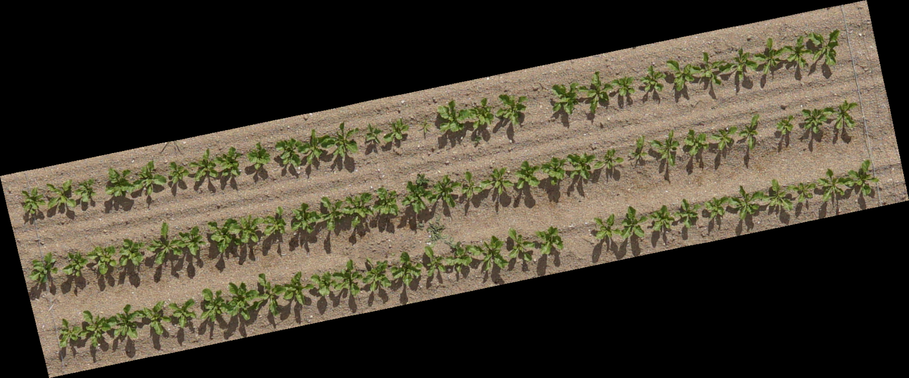
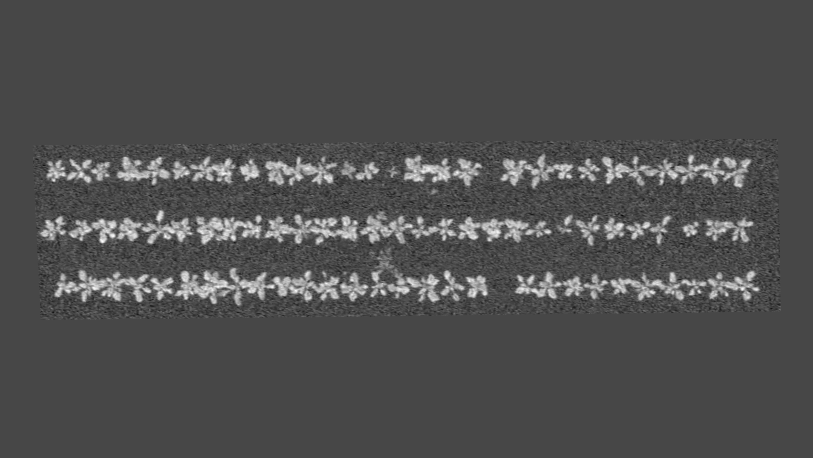
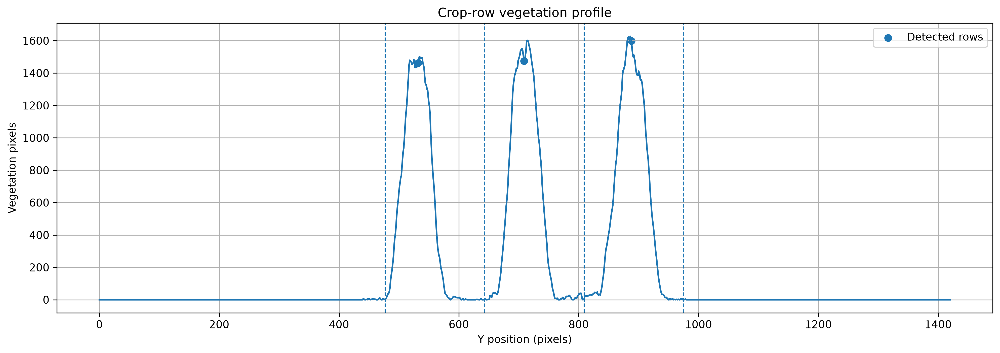
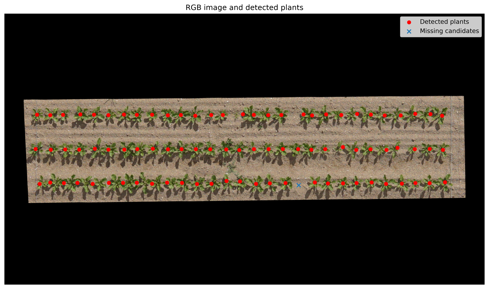

# OpenCropPhenotyping

**An open-source Python framework for high-throughput crop phenotyping using drone and satellite imagery.**

## About the project

OpenCropPhenotyping is an open-source project dedicated to reproducible high-throughput crop phenotyping using remote sensing data.
The objective is to provide reproducible workflows to extract agronomic traits from UAV and Sentinel-2 imagery, from raw image preprocessing to trait extraction, statistical analysis and visualization. 
The project currently combines multispectral Sentinel-2 processing with classical RGB UAV image analysis. The first UAV developments focus on crop-row detection, vegetation segmentation and plant-position analysis, with the objective of progressively extending the framework toward more advanced high-throughput phenotyping workflows.

## Current Features:
**Sentinel-2**
- [X] Sentinel-2 imagery reading
- [X] Sentinel-2 band selection and resampling
- [X] NDVI computation 
- [X] NDRE computation
- [X] GNDVI computation 
- [X] SAVI computation  
- [X] Generic vegetation index computation
- [X] Vegetation masking 
- [X] Crop cover estimation
- [X] Statistical analysis 
- [X] Sentinel-2 processing pipeline
- [X] Processing results export
- [X] Batch processing of multiple Sentinel-2 products
- [X] Visualization
- [X] Unit Tests
- [X] Command-Line Interface (CLI)

**UAV RGB**
- [X] RGB UAV imagery reading
- [X] RGB vegetation indices
- [X] Vegetation segmentation
- [X] Crop-row orientation estimation
- [X] Crop-row detection
- [X] Crop-row boundary detection
- [X] Planting position estimation from plot geometry
- [X] Vegetation based plant occupancy estimation
- [X] Georeferenced UAV Image support
- [X] Experimental plot metadata integration
- [X] UAV RGB workflow demonstration

**Software quality**
- [X] Visualization utilities
- [X] Unit tests
- [X] Code quality checks with Ruff
- [X] Reproducible toy datasets

## Case studies

The project includes reproducible case studies based on real agricultural areas in Southern France.

Current case studies:

- Maize monitoring with Sentinel-2 (Occitanie)
- UAV RGB crop-row and plant-position analysis on a toy dataset

## Roadmap

### Version 0.1
#### Sentinel-2

- Read Sentinel-2 imagery
- NDVI computation
- Visualization
- GeoTIFF export
- PNG export
- Toy dataset
- Unit tests

---

### Version 0.2
#### Vegetation indices and processing pipeline

- NDRE computation
- SAVI computation
- GNDVI computation
- Generic vegetation index computation
- Statistics
- Vegetation masking
- Trait Extraction (Crop cover)
- Sentinel-2 processing pipeline
- Processing results export
- Batch processing
- Command-line interface (CLI)

---

### Version 0.3
#### Drone imagery

- RGB UAV imagery reading
- RGB vegetation indices
- Vegetation segmentation
- Crop-row orientation estimation
- Crop-row detection
- Plant-position estimation
- Experimental plot geometry integration
- Georeferenced UAV image support
- UAV image tiling
- Batch processing of large UAV images

Current v0.3 development includes a classical, interpretable workflow for crop-row and plant-position analysis. Plant occupancy estimation currently relies on vegetation fraction within theoretical planting positions and is sensitive to plant development stage and image quality.

---

### Version 0.4
#### Machine Learning

- Feature extraction
- Dataset preparation
- Classical classifiers (Random Forest, SVM)
- Crop classification
- Model evaluation
- Model persistence

### Version 0.5
#### Deep Learning

- PyTorch support
- CNN semantic segmentation
- U-Net implementation
- Training pipeline
- Inference pipeline
- Model visualization

### Version 1.0

Complete crop phenotyping workflow

## For which users?

This project is intended for researchers, agronomists, engineers working in remote sensing, as well as for UAV practitioners and interested students. 
The project is also suitable for anyone wishing to learn how to process drone or Sentinel-2 imagery using Python.

## Installation

git clone ...

cd OpenCropPhenotyping

conda env create -f environment.yml

conda activate opencropphenotyping

pip install -e .

## How to use

The repository already includes a small Sentinel-2 toy dataset.

No additional data download is required to run the examples

## Command-line interface

OpenCropPhenotyping provides a command-line interface to process Sentinel-2 products directly from a terminal.

After installing the package, the opencropphenotyping command provides two main operations:

- process: process a single Sentinel-2 product.
- batch: process multiple Sentinel-2 products contained in a directory.

### Process a single product

```python
opencropphenotyping process \
    --input-dir path/to/Sentinel2_product \
    --output-dir path/to/results \
    --processed-dir path/to/processed \
    --indices ndvi \
    --ndvi-threshold 0.3 \
    --resolution 10
```

The command processes the Sentinel-2 product, computes the requested vegetation indices, generates the vegetation mask and crop-cover statistics, and exports the results.

### Process multiple products

```python
opencropphenotyping batch \
    --input-dir path/to/sentinel2_products \
    --output-dir path/to/results \
    --processed-dir path/to/processed \
    --indices ndvi \
    --ndvi-threshold 0.3 \
    --resolution 10
```

The input directory should contain one Sentinel-2 product per subdirectory. Each product is processed independently and its results are stored in a dedicated subdirectory.

For example:

input/  
├── S2A_MSIL2A_product_1.SAFE/  
└── S2B_MSIL2A_product_2.SAFE/

produces:

results/  
├── S2A_MSIL2A_product_1.SAFE/  
└── S2B_MSIL2A_product_2.SAFE/

### Get help

General help is available with:

```python
opencropphenotyping --help
```

Help for an individual command can be obtained with:

```python
opencropphenotyping process --help
```

or:

```python
opencropphenotyping batch --help
```

If an error occurs while processing a product, the CLI reports the error and exits with a non-zero status code.

## Example workflow

OpenCropPhenotyping currently provides two complementary image-processing workflows:

- Sentinel-2 multispectral processing
- UAV RGB crop-row and plant-position analysis

## Sentinel-2 workflow

The Sentinel-2 workflow processes multispectral bands to compute vegetation indices, derive vegetation masks and estimate crop cover.

### Sentinel-2 input bands

#### Sentinel-2 Red band (B04)


#### Sentinel-2 Near Infra Red band (B08)


#### Green band (B03)


#### Red Edge band (B05)


↓

### Vegetation indices

The selected Sentinel-2 bands are combined to compute several vegetation indices:

B04 Red ───────┬──→ NDVI  
&ensp;&ensp;&ensp;&ensp;&ensp;&ensp;&ensp;&ensp;&ensp;&ensp;&ensp;&ensp;&ensp;&ensp;&ensp;&ensp;&ensp;&nbsp;└──→ SAVI  
                         
B08 NIR ───────┬──→ NDVI  
&ensp;&ensp;&ensp;&ensp;&ensp;&ensp;&ensp;&ensp;&ensp;&ensp;&ensp;&ensp;&ensp;&ensp;&ensp;&ensp;&ensp;&nbsp;├──→ SAVI  
&ensp;&ensp;&ensp;&ensp;&ensp;&ensp;&ensp;&ensp;&ensp;&ensp;&ensp;&ensp;&ensp;&ensp;&ensp;&ensp;&ensp;&nbsp;├──→ GNDVI  
&ensp;&ensp;&ensp;&ensp;&ensp;&ensp;&ensp;&ensp;&ensp;&ensp;&ensp;&ensp;&ensp;&ensp;&ensp;&ensp;&ensp;&nbsp;└──→ NDRE  

B03 Green ────────→ GNDVI

B05 Red Edge ──────→ NDRE     

#### NDVI — Normalized Difference Vegetation Index


#### NDRE — Normalized Difference Red Edge Index


#### GNDVI — Green Normalized Difference Vegetation Index


#### SAVI — Soil-Adjusted Vegetation Index


↓

### Statistics and visualization

Statistics are computed for each vegetation index to characterize the distribution of pixel values.

#### NDVI distribution


#### NDVI boxplot


↓

### Trait extraction

The NDVI image is used to create a vegetation mask and estimate crop cover.

#### Vegetation mask


Crop cover: **39.24%**

↓

### Export

The processing results can be exported to a dedicated output directory.
For batch processing, each Sentinel-2 product is exported to its own subdirectory.

The exported files include:

- GeoTIFF files for the computed vegetation indices;
- a GeoTIFF file containing the vegetation mask;
- a CSV file containing statistics for each vegetation index;
- a text file containing the estimated crop cover.

The results directory is organized as follows:

results/   
├── indices/   
│ &ensp;&ensp;&ensp;├── ndvi.tif   
│ &ensp;&ensp;&ensp;├── savi.tif  
│ &ensp;&ensp;&ensp;├── ndre.tif  
│ &ensp;&ensp;&ensp;└── gndvi.tif  
├── vegetation_mask.tif  
├── statistics.csv  
└── crop_cover.txt 

### RGB UAV imagery

OpenCropPhenotyping also provides a classical RGB UAV workflow for crop-row and plant-position analysis.

The workflow is designed around a combination of:

- RGB image analysis
- ExG vegetation segmentation
- crop-row geometry
- georeferenced raster data
- experimental plot geometry
- plot-level metadata
- theoretical planting positions
- vegetation fraction within planting positions

The workflow can be demonstrated step by step or accessed through the high-level plant-detection function.

#### Load UAV RGB image

The workflow starts from an RGB UAV image.




↓

#### Georeferenced UAV image and experimental plot

To integrate experimental plot information into the image-processing workflow, the UAV image is converted into a georeferenced GeoTIFF.

The GeoTIFF stores both the RGB raster data and the spatial information required to relate image pixels to spatial coordinates.

The corresponding experimental plot is stored in a GeoPackage containing the plot geometry and experimental metadata, including:

- ```image_id```
- ```n_rows```
- ```n_plants```
- ```geometry```

The plot geometry is validated against the GeoTIFF to ensure that the experimental plot is correctly aligned with the image.

The plot geometry is then rasterized and transformed using the same crop-row rotation as the UAV image. This provides the spatial boundaries used to define crop-row regions and theoretical planting positions.

↓

#### Vegetation segmentation

RGB imagery is converted into an Excess Green (ExG) vegetation index and thresholded to produce a vegetation mask.




↓

#### Crop-row detection

The vegetation profile is used to estimate crop-row orientation and identify crop-row positions.
Experimental plot metadata are then used to define the expected number of crop rows and their spatial boundaries.



↓

#### Plant occupancy estimation

The experimental plot geometry and ```n_plants``` metadata are used to define theoretical planting positions along each crop row.

Vegetation fraction within each theoretical planting position is then used as an indicator of plant occupancy.




The current approach provides an interpretable classical baseline for UAV crop phenotyping. Its performance is influenced by plant development stage and the strength of the vegetation signal in the RGB imagery.

#### UAV workflow demonstration

A dedicated notebook demonstrates the complete workflow and the use of the package functions:

notebooks/  
└── 06_UAV RGB workflow demonstration.ipynb

The notebook also contains examples of intermediate visualizations and exported figures used for project documentation.

#### RGB UAV imagery

RGB images are loaded as three NumPy arrays corresponding to the red, green and blue channels:
```python
from opencropphenotyping.rgb import read_rgb_image

red, green, blue = read_rgb_image(image_path)
```
The three returned arrays have the same spatial dimensions as the input image.

This functionality provides the foundation for RGB-based vegetation segmentation, crop-row detection and plant-position analysis.

### Processing pipeline

The Sentinel-2 processing pipeline provides a high-level interface to process Sentinel-2 imagery and extract vegetation-related traits.

```python
from pathlib import Path

from opencropphenotyping.pipeline import (
    process_sentinel2,
    export_results,
)

input_dir = Path("data/raw")
output_dir = Path("data/processed")

result = process_sentinel2(
    input_dir=input_dir,
    indices=["ndvi", "ndre"],
    resolution=10,
    ndvi_threshold=0.3,
)

export_results(
    result,
    output_dir=output_dir,
)
```

The indices parameter can be used to select which vegetation indices are computed:

```python
indices=["ndvi"]
```

or:

```python
indices=["ndvi", "savi", "ndre", "gndvi"]
```

If ```python indices=None```, all available vegetation indices are requested.

If the bands required for a requested index are unavailable, that index is not computed and the pipeline continues processing the other available indices.

When NDVI is available, the pipeline also creates a vegetation mask and estimates crop cover.

### Processing results

The process_sentinel2() function returns a ProcessingResult object containing:

- the computed vegetation indices;
- the raster profile;
- statistics for each computed index;
- the vegetation mask, when NDVI is available;
- the crop cover estimate, when NDVI is available.

The results can then be exported using export_results().

## Contributing 

Contributions are welcome. If you have ideas for improvements, bug fixes or new features, feel free to open an issue or submit a pull request.

## Documentation

Documentation will be progressively added as the project evolves.
The repository currently provides detailed notebooks illustrating the development and application of the processing workflows.

## Version

This project follows Semantic Versioning (SemVer). 
See the Releases page for available versions and change logs.

## LICENSE

See the LICENSE file.
