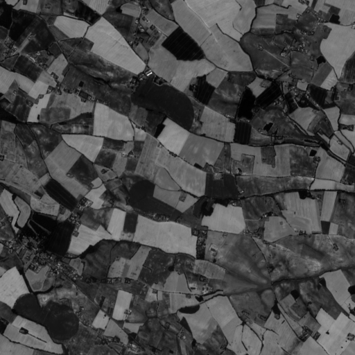
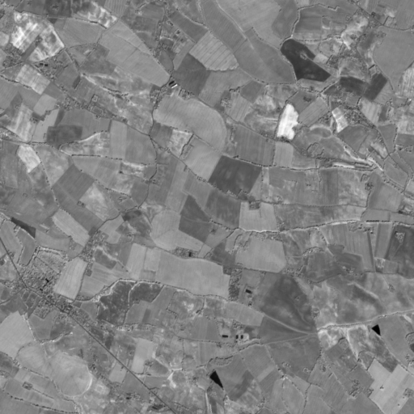
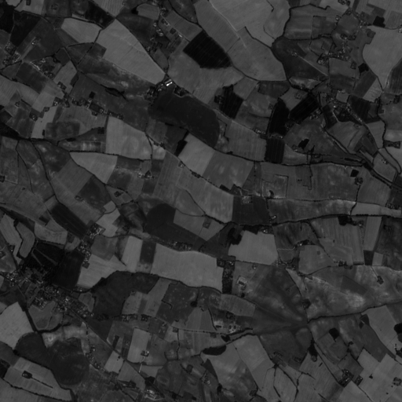
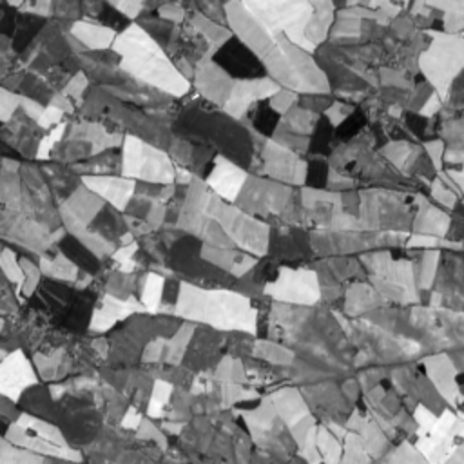
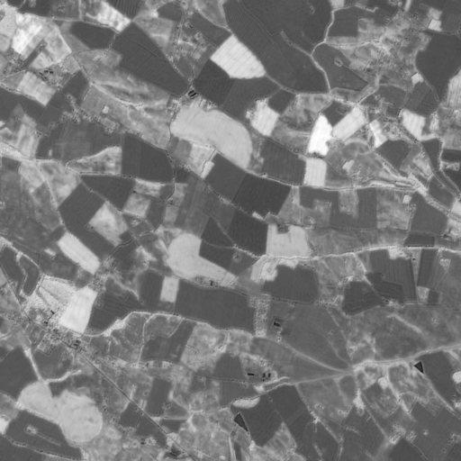
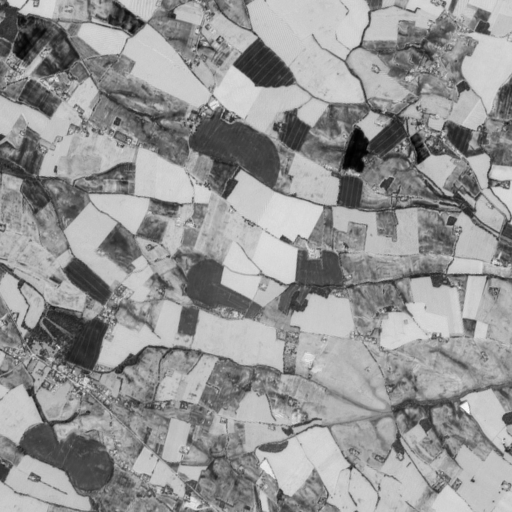
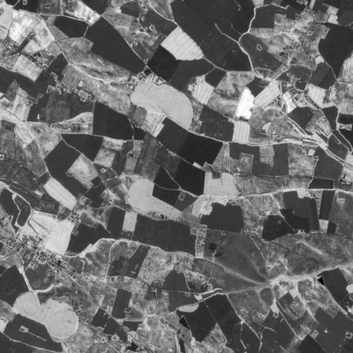
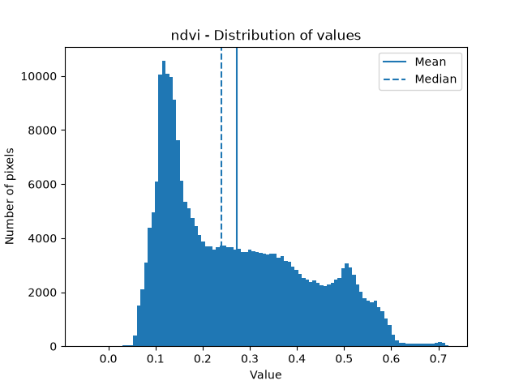
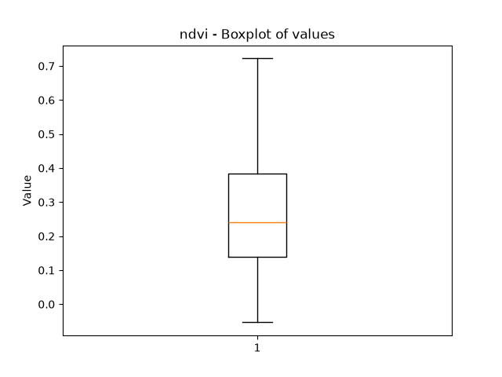
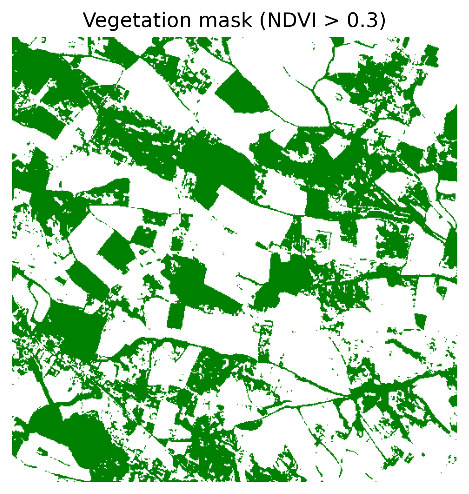

# OpenCropPhenotyping

**An open-source Python framework for high-throughput crop phenotyping using drone and satellite imagery.**

## About the project
OpenCropPhenotyping is an open-source project dedicated to reproducible high-throughput crop phenotyping using remote sensing data.
The objective is to provide reproducible workflows to extract agronomic traits from UAV and Sentinel-2 imagery, from raw image preprocessing to trait extraction, statistical analysis and visualization. The first developments focus on major field crops such as maize, with the possibility of extending the framework to other crops in future releases.

## Current Features:
- [X] Sentinel-2 imagery reading
- [X] Sentinel-2 band selection and resampling
- [X] NDVI computation 
- [X] NDRE computation
- [X] GNDVI computation 
- [X] SAVI computation  
- [X] Generic vegetation index computation
- [X] Vegetation masking 
- [X] Crop cover estimation
- [X] Statistical analysis 
- [X] Sentinel-2 processing pipeline
- [X] Processing results export
- [X] Batch processing of multiple Sentinel-2 products
- [X] Visualization
- [X] Unit Tests
- [X] Command-Line Interface (CLI)
- [X] RGB UAV imagery reading

## Case studies

The project includes reproducible case studies based on real agricultural areas in Southern France.

Current case studies:

- Maize monitoring with Sentinel-2 (Occitanie)

## Roadmap

### Version 0.1
#### Sentinel-2

- Read Sentinel-2 imagery
- NDVI computation
- Visualization
- GeoTIFF export
- PNG export
- Toy dataset
- Unit tests

---

### Version 0.2
#### Vegetation indices and processing pipeline

- NDRE computation
- SAVI computation
- GNDVI computation
- Generic vegetation index computation
- Statistics
- Vegetation masking
- Trait Extraction (Crop cover)
- Sentinel-2 processing pipeline
- Processing results export
- Batch processing
- Command-line interface (CLI)

---

### Version 0.3
#### Drone imagery

- RGB UAV imagery reading
- Orthomosaic support
- Vegetation segmentation
- RGB vegetation indices
- Image tiling

---

### Version 0.4
#### Machine Learning

- Feature extraction
- Dataset preparation
- Classical classifiers (Random Forest, SVM)
- Crop classification
- Model evaluation
- Model persistence

### Version 0.5
#### Deep Learning

- PyTorch support
- CNN semantic segmentation
- U-Net implementation
- Training pipeline
- Inference pipeline
- Model visualization

### Version 1.0

Complete crop phenotyping workflow

## For which users?

This project is intended for researchers, agronomists, engineers working in remote sensing, as well as for UAV practitioners and interested students. The project is also suitable for anyone wishing to learn how to process drone or Sentinel-2 imagery using Python.

## Installation

git clone ...

cd OpenCropPhenotyping

conda env create -f environment.yml

conda activate opencropphenotyping

pip install -e .

## How to use

The repository already includes a small Sentinel-2 toy dataset.

No additional data download is required to run the examples

## Command-line interface

OpenCropPhenotyping provides a command-line interface to process Sentinel-2 products directly from a terminal.

After installing the package, the opencropphenotyping command provides two main operations:

- process: process a single Sentinel-2 product.
- batch: process multiple Sentinel-2 products contained in a directory.

### Process a single product

```python
opencropphenotyping process \
    --input-dir path/to/Sentinel2_product \
    --output-dir path/to/results \
    --processed-dir path/to/processed \
    --indices ndvi \
    --ndvi-threshold 0.3 \
    --resolution 10
```

The command processes the Sentinel-2 product, computes the requested vegetation indices, generates the vegetation mask and crop-cover statistics, and exports the results.

### Process multiple products

```python
opencropphenotyping batch \
    --input-dir path/to/sentinel2_products \
    --output-dir path/to/results \
    --processed-dir path/to/processed \
    --indices ndvi \
    --ndvi-threshold 0.3 \
    --resolution 10
```

The input directory should contain one Sentinel-2 product per subdirectory. Each product is processed independently and its results are stored in a dedicated subdirectory.

For example:

input/
├── S2A_MSIL2A_product_1.SAFE/
└── S2B_MSIL2A_product_2.SAFE/

produces:

results/
├── S2A_MSIL2A_product_1.SAFE/
└── S2B_MSIL2A_product_2.SAFE/

### Get help

General help is available with:

opencropphenotyping --help

Help for an individual command can be obtained with:

opencropphenotyping process --help

or:

opencropphenotyping batch --help

If an error occurs while processing a product, the CLI reports the error and exits with a non-zero status code.

## Example workflow

The following workflow illustrates the processing of Sentinel-2 multispectral imagery, from the input bands to vegetation indices, statistical analysis and crop trait extraction.

### Sentinel-2 input bands

#### Sentinel-2 Red band (B04)



#### Sentinel-2 Near Infra Red band (B08)



#### Green band (B03)



#### Red Edge band (B05)



↓

### Vegetation indices

The selected Sentinel-2 bands are combined to compute several vegetation indices:

B04 Red ───────┬──→ NDVI  
&ensp;&ensp;&ensp;&ensp;&ensp;&ensp;&ensp;&ensp;&ensp;&ensp;&ensp;&ensp;&ensp;&ensp;&ensp;&ensp;&ensp;&nbsp;└──→ SAVI  
                         
B08 NIR ───────┬──→ NDVI  
&ensp;&ensp;&ensp;&ensp;&ensp;&ensp;&ensp;&ensp;&ensp;&ensp;&ensp;&ensp;&ensp;&ensp;&ensp;&ensp;&ensp;&nbsp;├──→ SAVI  
&ensp;&ensp;&ensp;&ensp;&ensp;&ensp;&ensp;&ensp;&ensp;&ensp;&ensp;&ensp;&ensp;&ensp;&ensp;&ensp;&ensp;&nbsp;├──→ GNDVI  
&ensp;&ensp;&ensp;&ensp;&ensp;&ensp;&ensp;&ensp;&ensp;&ensp;&ensp;&ensp;&ensp;&ensp;&ensp;&ensp;&ensp;&nbsp;└──→ NDRE  

B03 Green ────────→ GNDVI

B05 Red Edge ──────→ NDRE     

#### NDVI — Normalized Difference Vegetation Index


#### NDRE — Normalized Difference Red Edge Index



#### GNDVI — Green Normalized Difference Vegetation Index



#### SAVI — Soil-Adjusted Vegetation Index



↓

### Statistics and visualization

Statistics are computed for each vegetation index to characterize the distribution of pixel values.

#### NDVI distribution



#### NDVI boxplot



↓

### Trait extraction

The NDVI image is used to create a vegetation mask and estimate crop cover.

#### Vegetation mask



Crop cover: **39.24%**

↓

### Export

The processing results can be exported to a dedicated output directory.
For batch processing, each Sentinel-2 product is exported to its own subdirectory.

The exported files include:

- GeoTIFF files for the computed vegetation indices;
- a GeoTIFF file containing the vegetation mask;
- a CSV file containing statistics for each vegetation index;
- a text file containing the estimated crop cover.

The results directory is organized as follows:

results/   
├── indices/   
│ &ensp;&ensp;&ensp;├── ndvi.tif   
│ &ensp;&ensp;&ensp;├── savi.tif  
│ &ensp;&ensp;&ensp;├── ndre.tif  
│ &ensp;&ensp;&ensp;└── gndvi.tif  
├── vegetation_mask.tif  
├── statistics.csv  
└── crop_cover.txt 

### RGB UAV imagery

OpenCropPhenotyping supports the reading of RGB images acquired from UAV platforms.

RGB images are loaded as three separate NumPy arrays corresponding to the red, green and blue channels:

```python
from opencropphenotyping.rgb import read_rgb_image

red, green, blue = read_rgb_image(image_path)
```

The three returned arrays have the same spatial dimensions as the input image.

This functionality provides the foundation for future RGB-based workflows, including vegetation segmentation, RGB vegetation indices and crop trait extraction.

### Processing pipeline

The Sentinel-2 processing pipeline provides a high-level interface to process Sentinel-2 imagery and extract vegetation-related traits.

```python
from pathlib import Path

from opencropphenotyping.pipeline import (
    process_sentinel2,
    export_results,
)

input_dir = Path("data/raw")
output_dir = Path("data/processed")

result = process_sentinel2(
    input_dir=input_dir,
    indices=["ndvi", "ndre"],
    resolution=10,
    ndvi_threshold=0.3,
)

export_results(
    result,
    output_dir=output_dir,
)
```

The indices parameter can be used to select which vegetation indices are computed:

```python
indices=["ndvi"]
```

or:

```python
indices=["ndvi", "savi", "ndre", "gndvi"]
```

If ```python indices=None```, all available vegetation indices are requested.

If the bands required for a requested index are unavailable, that index is not computed and the pipeline continues processing the other available indices.

When NDVI is available, the pipeline also creates a vegetation mask and estimates crop cover.

### Processing results

The process_sentinel2() function returns a ProcessingResult object containing:

- the computed vegetation indices;
- the raster profile;
- statistics for each computed index;
- the vegetation mask, when NDVI is available;
- the crop cover estimate, when NDVI is available.

The results can then be exported using export_results().

## Contributing 

Contributions are welcome. If you have ideas for improvements, bug fixes or new features, feel free to open an issue or submit a pull request.

## Documentation

Documentation will be progressively added as the project evolves.

## Version

This project follows Semantic Versioning (SemVer). 
See the Releases page for available versions and change logs.

## LICENSE

See the LICENSE file.
